Signal processing simulator with code generator and GUI editor

# Disclaimer

This is an alpha version. It means that all planned features for this iteration
was implemented, but didn't tested at all. At this stage program may be
unstable, all of the bugs would be fixed before the beta. Also back
compatibility is not guaranteed. Use it at your own risk.

# User manual

## Editing schemes

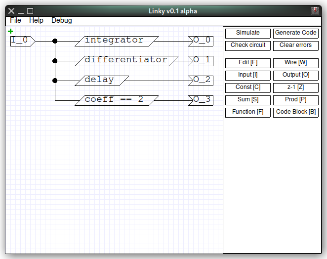

Main window consists of editing area and command palette. Green cross on the
editing area is a cursor and you can control it using mouse ore keyboard.
[Up], [Down], [Left] and [Right] arrows moves it for a one grid step. These keys
with [Shift] moves view point, [Ctrl] modifier with [Up] or [Down] buttons
magnifies the circuit. Mouse wheel scrolls circuit area up and down, with
[Shift] modifier it scrolls left and right, [Ctrl] modifier for magnifying.
[Space] and left mouse click are the same action and it depends on a current
editing mode. [Esc] resets the input mode. Current input mode is highlighted
on the command palette buttons, one of them becames green when selected.
[Del] and [x] buttons deletes element with active corner under the cursor.
Active corner is top left. Command palette have some hardcoded keybindings for
input modes. Inputs on all of the objects are placed left, all outputs are
placed right.

### Normal mode

It's a default mode when you open the editor, also [Esc] invokes it. This mode
is not highlighted. In this mode you can move objects with mouse + pressed left
button, or arrows keyboard buttons + [Space] pressed. When you moving objects
with a keyboard, cursor stays still, but selected object is moving. Objects
with active corner under the cursor becames highlighted with a blue square.
When wire point is under the cursor, all points would highlight with an empty
blue square.

### Edit mode

Invokes by key [E] or pressing the button. In this mode all editable elements
highlighted by green empty square on their active corner. Pressing [Space] or
left mouse button opens editing properties modal window. Each kind of element
have its own editing window, some element even have no editable preferences and
pressing on it makes no effect.

### Wire mode

Invokes by key [W] or pressing the button. This mode needs to connect units
together. In this mode all unit inputs would be highlighted with green circles,
all outputs with blue circles, edges of wire lines would be highlighted with
empty blue square.

### Input mode

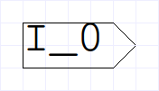

Invokes by key [I] or pressing the button.
Inserts the input with default name on a circuit. Only editable parameter is
the name. It should be unique, can contain only [a-zA-Z_] characters.

### Output mode

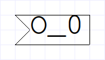

Invokes by key [O] or pressing the button.
Inserts the output with default name on a circuit. Only editable parameter is
the name. It should be unique, can contain only [a-zA-Z_] characters.

### Constant mode

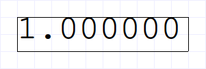

Invokes by key [C] or pressing the button.
Inserts the constant value on a circuit. Only editable parameter is the
floating-point value.

### Delay mode

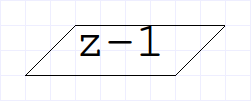

Invokes by key [Z] or pressing the button.
Inserts the delay line on a circuit. It's equal to the unit with a transfer
function z^(-1). You can adjust delay value, it should be positive integer.

### Sum mode

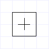

Invokes by key [S] or pressing the button.
Insert the summator on a circuit. Have two inputs and one output. You can't
adjust it.

### Product mode

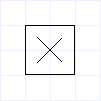

Invokes by key [P] or pressing the button.
Insert the multiplicator on a circuit. Have two inputs and one output. You can't
adjust it.

### Function mode

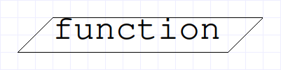

Invlokes by key [F] or pressing the button.
Insert the transfer function on a circuit. Have one input and one output.
You can set up unit's name and numerator and denominator polynoms. Transfer
function is represented as two rows of coefficients for numerator and
denominator polynoms. For examplem differentiator have transfer function:

```
                    1 * z^0 - 1 * z^(-1)
H(z) = 1 - z^(-1) = --------------------;
                          1 * z^0
```

Numerator coefficients row is: 1, -1.
Denominator coefficients row is: 1.

Row settings should be filled with floating-point numbers separated by ';'.
Also ';' should terminate the list.

### Code Block mode

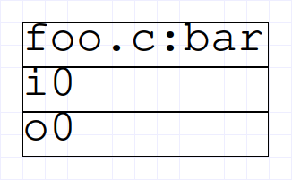

Invokes by key [B] or pressing the button.
Insert the external code call on a circuit. You can set up the name of the
source file with function implementation, name of the function, lists of the
outputs and inputs of the function and size of the context. Callable code
requirements are same as described in the Code Generation section of this
document. Requirement to inputs and outputs names are same as for the circuit's
inputs and outputs. Rules of lists are similar to functions polynoms, but
instead of floating-point numbers you enter names.

## Error Checking

Checking circuit invokes when you push Simulate, Generate Code or Check circuit
buttons. Problem places would be highlighted with a red color.

Linky detects next problems:

- Unit that can't be resolved when code is generated.
- Wire isn't connected to the output.
- Several outputs are connected to the same wire.

The main reasons why unit can't be resolved are:

- There is some unconnected inputs of the unit
- Unit input is connected to the some output, but it's data are not available
right now. For example it happens when you trying to make a loopback. Linky
works in a simple way and didn't perform complex symbolic calculations, so
it just runs through the network and calculates the order of calculations.
There is some important parameter as data availability. Some units have always
available data on their outputs, such a circuit input, constant, delay line and
transfer functions that have more than one numerator coefficient in the polynom.
Just add one of them in loopback to solve this issue. Other units are solved
only when they have the actual data on their inputs, so at this moment they
can push data to their outputs.

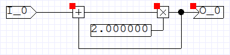

Highlighting errors resets when you click on the Clear errors button or change
the circuit somehow.

## Code Generation

Code generation invokes with a Generate Code button. First, the circuit would
be checked and after ther, if there is no errors, code would be saved in the
same folder where Linky was opened in a pair of .c and .h files. Name would be
same as the source circuit .liny file.

In header file you may see three sections of defines:

1. Declarations of the inputs indexes.
2. Declarations of the outputs indexes.
3. Declarations of context sections, it needs for inner purposes.

Signature of the function is:

```
void func(float* inputs, float* outputs, float* context);
```

Function passes three pointers to the arrays. Sizes of these arrays are defined
with macro in sections described above. Use case is:

1. Fill the inputs array.
2. Call function.
3. Output values would be saved in output array.

Context is very important. You should initialize it with zeros and keep it
between the function calls.

## Simulation

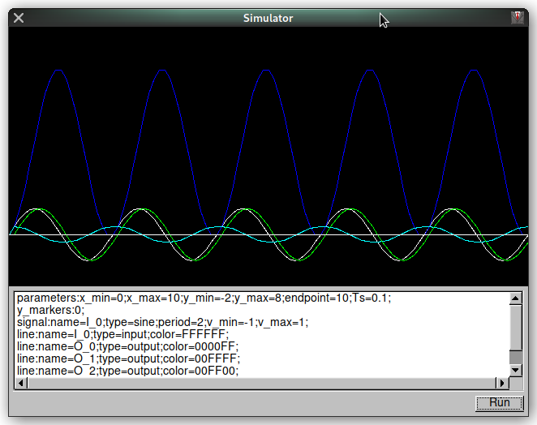

Invokes by Simulate button.
Simulator have a gnuplot-like control. There is settings editor and Run button.

Simulation starts with next steps:

1. Check the circuit.
2. Generate code.
3. Compile the code.
4. Parse simulation parameters.
5. Prepare simulation database.
6. Run the code.
7. Draw the result on the chart.

Synthax of simulation parameters is simple:

```
<command>:<param>=<value>;<param>=<value>;<newline>
```

### parameters

This command sets time and value displaying parameters:

- Ts, discretization period
- endpoint, time when the simulation stops
- x\_min, minimum displaying time
- x\_max, maximum displaying time
- y\_min, minimal displaying value
- y\_max, maximum displaying value

### signal

Linky can generate next signal on the circuit outputs:

- sine, sinusoid
- step, unit step function
- delta, single pitch with selected width, may be used as dirac delta
- meander, simple square function
- sawtooth, raising sawtooth
- rsawtooth, falling sawtooth

This command connects test signals to the circuit inputs and have next
parameters:

- name, name of the input to connect
- type, type of the signal, may be "sine", "step", "delta", "meander",
"sawtooth", "rsawtooth"
- delay, time before the signal would be applyed
- v\_min, minimal value of the signal
- v\_max, maximal value of the signel
- period, period in seconds of looped signals
- width, width in seconds of active state of the delta dirac function
- ratio, koefficient of width of the active state of meander signal respectively
to the period

### x\_markers

Draws the vertical lines in selected points. Example:

```
x\_markers:0;1;2;
```

### y\_markers

Draws the horizontal lines in selected points. Similar to the x_markers.

### line

Selects what to draw on the chart:

- name, name of output or input of the circuit to draw
- type, may be "input" or "output"
- color, hex RGB color, numbers and [a-fA-F] only

# Building

Dependencies: fltk, gcc.
Runtime dependencies: fltk, gcc, it needs for simulation.
Build system: make.

Just install all dependencies from your distributive packet manager and run
make. Default target build binary and runs it.

For now it's a Linux-only program and it still requires FLTK library and gcc,
but there are some plans to make it cross-platform and compiler-independend.

# Hacking

The core concept of this project conjuncted with Independency library and
its usage. Main idea is using dynamic global heirarchical structures.
For now there is three structures: circuit, context and params (this one
isn't uset yet). In a first glance it may looks overkill, because logically
there is no any difference between regular structures. But it have an advantage:
it expands the time gap between you started the implementation and project
reach point when it should be refactored if you want implement features without
pain. Independency provides dynamic structure that highly protected from many
kinds of access errors. For example, there is no problem to use the value
of the unexisted variable, program would not crash, you may easily fix the
error another way. That's why development speed increased.

But this approach have an other side. It accumulates a lot of little errors,
there are thousands ways to garbage the project. And in some point you must
to describe how it's actually working, because the real complexity is hiding
behind the similarity of usage, and you must reveal it.

I think it's obvious that I reached this point. And that's why this section
written and would be grow together with code from now. But I not guarantee
that this section would be enough to clearly understand the project.

## Circuit structure

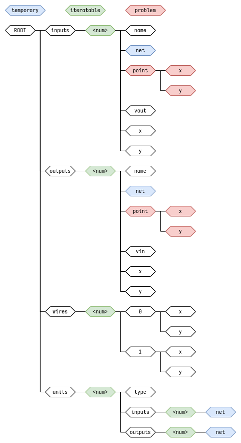

### Constant unit

| field | desc |
| --- | --- |
| type | \<string\> identifier of type |
| value | \<float\> numeric value of the constant |
| outputs/0/x,y | coordinates of the single output (circuit grid units) |

### Delay unit

| field | desc |
| --- | --- |
| type | \<string\> identifier of type |
| value | \<int\> delay (samples) |
| inputs/0/x,y | coordinates of the single input (circuit grid units) |
| outputs/0/x,y | coordinates of the single output (circuit grid units) |

### Sum unit

| field | desc |
| --- | --- |
| type | \<string\> identifier of type |
| inputs/0/x,y | coordinates of the horizontal signal line (circuit grid units) |
| inputs/1/x,y | coordinates of the vertical signal line (circuit grid units) |
| outputs/0/x,y | coordinates of the single output (circuit grid units) |

### Difference unit

| field | desc |
| --- | --- |
| type | \<string\> identifier of type |
| inputs/0/x,y | coordinates of the horizontal signal line (circuit grid units) |
| inputs/1/x,y | coordinates of the vertical signal line (circuit grid units) |
| outputs/0/x,y | coordinates of the single output (circuit grid units) |

### Product unit

| field | desc |
| --- | --- |
| type | \<string\> identifier of type |
| inputs/0/x,y | coordinates of the horizontal signal line (circuit grid units) |
| inputs/1/x,y | coordinates of the vertical signal line (circuit grid units) |
| outputs/0/x,y | coordinates of the single output (circuit grid units) |

### Division unit

| field | desc |
| --- | --- |
| type | \<string\> identifier of type |
| inputs/0/x,y | coordinates of the horizontal signal line (circuit grid units) |
| inputs/1/x,y | coordinates of the vertical signal line (circuit grid units) |
| outputs/0/x,y | coordinates of the single output (circuit grid units) |

### Function unit

| field | desc |
| --- | --- |
| type | \<string\> identifier of type |
| function name | \<string\> displayed name |
| numerator poly | \<string\> coefficients of the numerator polynom |
| denominator poly | \<string\> coefficients of the denominator polynom |
| inputs/0/x,y | coordinates of the single input (circuit grid units) |
| outputs/0/x,y | coordinates of the single output (circuit grid units) |

### Loopback unit

| field | desc |
| --- | --- |
| type | \<string\> identifier of type |
| value | \<int\> loopback delay (samples) |
| inputs/0/x,y | coordinates of the single input (circuit grid units) |
| outputs/0/x,y | coordinates of the single output (circuit grid units) |

### Coeff unit

| field | desc |
| --- | --- |
| type | \<string\> identifier of type |
| value | \<float\> value of the coefficient |
| inputs/0/x,y | coordinates of the single input (circuit grid units) |
| outputs/0/x,y | coordinates of the single output (circuit grid units) |

### ABS unit

| field | desc |
| --- | --- |
| type | \<string\> identifier of type |
| inputs/0/x,y | coordinates of the single input (circuit grid units) |
| outputs/0/x,y | coordinates of the single output (circuit grid units) |

### Limit max unit

| field | desc |
| --- | --- |
| type | \<string\> identifier of type |
| value | \<float\> maximum value |
| inputs/0/x,y | coordinates of the single input (circuit grid units) |
| outputs/0/x,y | coordinates of the single output (circuit grid units) |

### Limit min unit

| field | desc |
| --- | --- |
| type | \<string\> identifier of type |
| value | \<float\> minimum value |
| inputs/0/x,y | coordinates of the single input (circuit grid units) |
| outputs/0/x,y | coordinates of the single output (circuit grid units) |

## Context structure

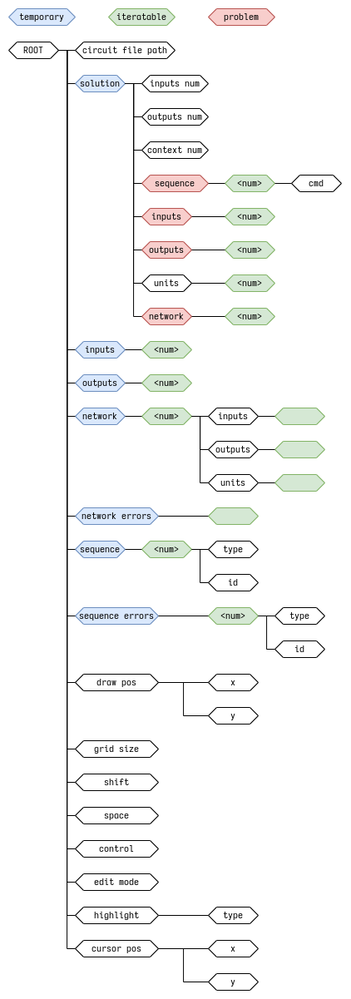

# License

Asshole Public Licence (APL):

If you like this code, just tell your buddies about it or you'll be an asshole.

Yes, it's the full text of the licence. Simple, right?
